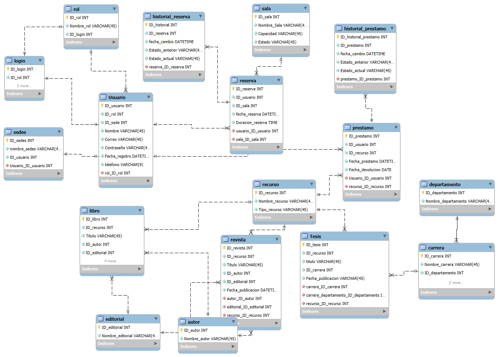
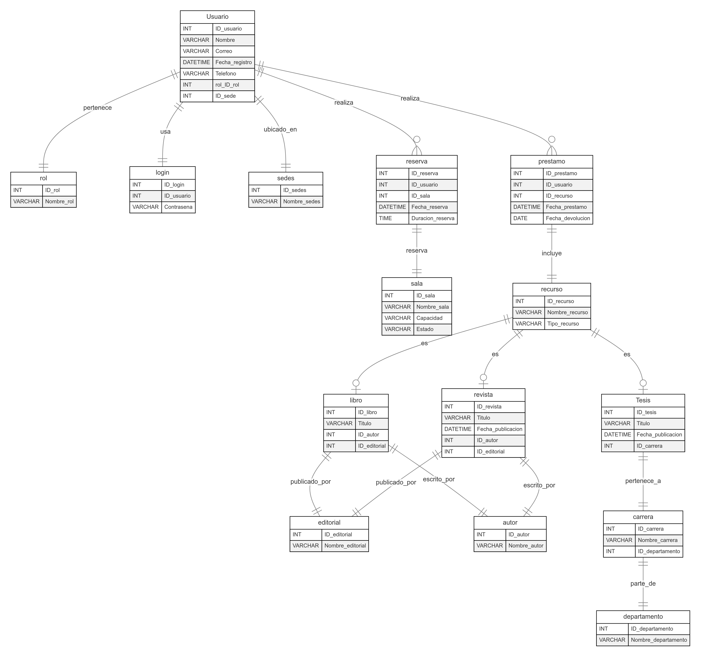

# sistema_biblioteca
Trabajo aplicativo del curso de Base de Datos 2024 - II

--- 

# 📚 Sistema Gestión de Biblioteca 📚

## 📄 Documentación del Proyecto 📄

### Enlace al prototipo en Figma

Puedes acceder al prototipo del sistema en Figma a través del siguiente enlace:  
[🔗 Accede al proyecto en Figma aquí](https://www.figma.com/design/Mzpvo9wVfpwevF7oNaSKRj/SISTEMA-DE-BIBLIOTECA-%7C-BASE-DE-DATOS?node-id=0-1&m=dev&t=aKSRxW9SkNl97Hxp-1)

### Tabla de Contenidos

1. [📄 Introducción 📄](#📄-introducción-📄)

2. [🎯 Objetivo del Proyecto 🎯](#🎯-objetivo-del-proyecto-🎯)

3. [📌 Funcionalidades Principales 📌](#📌-funcionalidades-principales-📌)

4. [📂 Módulos del Sistema 📂](#📂-módulos-del-sistema-📂)

5. [🗂️ Estructura de la Base de Datos 🗂️](#🗂️-estructura-de-la-base-de-datos-🗂️)

6. [🔗 Relaciones Principales 🔗](#🔗-relaciones-principales-🔗)

7. [🛠️ Tecnologías Utilizadas 🛠️](#🛠️-tecnologías-utilizadas-🛠️)

8. [📚 Conclusiones y Próximos Pasos 📚](#📚-conclusiones-y-próximos-pasos-📚)

---

## 📄 Introducción 📄

La biblioteca es un recurso clave para la comunidad académica, proporcionando acceso a libros y espacios de trabajo colaborativo. Sin embargo, la gestión manual de préstamos, devoluciones y reservas puede resultar ineficiente y propensa a errores.  

Este proyecto busca implementar un **sistema de gestión integral de biblioteca** que optimice y automatice estos procesos. La solución se centra en cubrir las necesidades específicas de los  usuarios.

## 🎯 Objetivo del Proyecto 🎯

El objetivo principal de este proyecto es **diseñar e implementar un sistema de gestión integral para la biblioteca** que permita optimizar los procesos de registro, préstamo, devolución y reserva de recursos, garantizando un uso eficiente y transparente de los mismos.  

### Objetivos Específicos:  
1. **Automatizar la gestión de préstamos y devoluciones:**  
   Reducir el tiempo y los errores asociados a los registros manuales mediante la implementación de procedimientos almacenados y controles automáticos en la base de datos.  

2. **Facilitar la administración de reservas:**  
   Proporcionar un módulo de reservas de cubículos que asegure la disponibilidad y evite conflictos de horarios entre los usuarios.  

3. **Mejorar la experiencia de los usuarios:**  
   Ofrecer una solución clara y organizada que permita a estudiantes acceder fácilmente a los recursos de la biblioteca.  

4. **Centralizar y estructurar la información:**  
   Diseñar una base de datos relacional que consolide los datos de usuarios, recursos y reservas, facilitando la trazabilidad y la gestión.  

5. **Proveer herramientas de análisis:**  
   Implementar reportes dinámicos y visualizaciones con Power BI para identificar patrones de uso, recursos más demandados y necesidades futuras.  

6. **Fomentar la sostenibilidad del sistema:**  
   Asegurar que el diseño y la estructura del sistema permitan futuras ampliaciones o integraciones con otros sistemas del instituto.  

Este proyecto busca no solo cubrir las necesidades actuales de la biblioteca, sino también ofrecer una base sólida para el crecimiento y la mejora continua.  

El sistema incluye módulos para:  
- Registrar y mantener la información de los usuarios y recursos.  
- Administrar el ciclo completo de préstamos y devoluciones.  
- Gestionar reservas de cubículos para trabajo en equipo con horarios claros.  
- Generar reportes detallados para facilitar la toma de decisiones informadas.  

Además, se ha diseñado una base de datos relacional robusta con más de 15 tablas interconectadas, procedimientos almacenados para automatizar tareas repetitivas, permitiendo identificar tendencias y optimizar la asignación de recursos.  

Este sistema no solo mejora la eficiencia operativa de la biblioteca, sino que también proporciona a la comunidad académica una experiencia de usuario más fluida y satisfactoria.  

---

## 📌 Funcionalidades Principales 📌

1. **Gestión de Usuarios:**
   - Registro y actualización de información de estudiantes y docentes
   - Relación de usuarios con departamentos y carreras.

2. **Gestión de Recursos:**
   - Control de préstamos de libros, revistas y tesis
   - Reglas específicas según el tipo de usuario y recurso.

3. **Reservas:**
   - Reserva de cubículos para trabajo en equipo.
   - Control de horarios y disponibilidad.

4. **Procedimientos Automatizados:**
   - Procedimientos almacenados para agilizar la gestión de préstamos y devoluciones.
   - Generación de reportes de uso y disponibilidad de recursos.

5. **Análisis y Reportes:**
   - Reportes dinámicos sobre el uso de recursos y comportamiento de los usuarios.
---

## 📂 Módulos del Sistema 📂

| **Módulo**           | **Descripción**                                                              |
| -------------------- | ---------------------------------------------------------------------------- |
| **Administrador**    | Registro, consulta y gestión de la información personal.                     |
| **Alumno**           | Permite realizar préstamos a través de la plataforma.                        |
| **Préstamo**         | Gestión de programación y asignación de material bibliográfico.              |
| **Reserva**          | Gestión de programación y asignación de cubículos de trabajo en equipo.      |
| **Reporte**          | Almacenamiento de diagnósticos, tratamientos y resultados de consultas.      |

---

## 🗂️ Estructura de la Base de Datos 🗂️

### 📊 Esquema General
Este es un resumen completo de las tablas y relaciones de la base de datos del sistema de gestión biblioteca.

También se añade el diagrama en formato Mermaid de las tablas

>**Usuario**

- ID_Usuario INT ***PRIMARY KEY***,
- ID_Rol INT ***NOT NULL***,
- ID_Rol INT ***NOT NULL***,
- Nombre VARCHAR2(100) ***NOT NULL***,
- Correo VARCHAR2(100) ***NOT NULL UNIQUE***,
- Contraseña VARCHAR2(255) ***NOT NULL***,
- Fecha_Registro DATETIME ***DEFAULT CURRENT_TIMESTAMP***,
- Telefono INT ***NOT NULL***,
- **FOREIGN KEY** (ID_Rol) **REFERENCES** Rol(ID_Rol)
- **FOREIGN KEY** (ID_Sede) **REFERENCES** Rol(ID_Sede)

> **Rol**

- ID_Rol INT ***PRIMARY KEY***,
- Nombre_Rol VARCHAR2(50) ***NOT NULL***

> **Sede**

- ID_sede INT ***PRIMARY KEY***,
- Nombre_sede VARCHAR2(50) ***NOT NULL***

> **Login**

- id_login INT ***PRIMARY KEY***,
- ID_Rol INT ***NOT NULL***;
- ID_Usuario INT ***NOT NULL***

> **Reserva**

- ID_Reserva INT ***PRIMARY KEY***,
- ID_Usuario INT ***NOT NULL***,
- ID_Aula INT ***NOT NULL***,
- Fecha_Reserva DATETIME ***DEFAULT CURRENT_TIMESTAMP***,
- Duracion_reserva DATE,
- ***FOREIGN KEY*** (ID_Usuario) ***REFERENCES*** Usuario(ID_Usuario),
- ***FOREIGN KEY*** (ID_Aula) ***REFERENCES*** Aula(ID_Aula)

> **Sala**

- ID_sala INT ***PRIMARY KEY***,
- Nombre_sala VARCHAR2(20) ***NOT NULL***,
- Capacidad INT ***NOT NULL***
- Estado VARCHAR2(15) ***NOT NULL***

> **Historial_reserva**

- ID_Historial INT ***PRIMARY KEY***,
- ID_Reserva INT ***NOT NULL***,
- Fecha_Cambio DATETIME ***DEFAULT CURRENT_TIMESTAMP***,
- Estado_Anterior VARCHAR2(20),
- Estado_Actual VARCHAR2(20),
- ***FOREIGN KEY*** (ID_Reserva) ***REFERENCES*** Reserva(ID_Reserva)

> **Préstamo**

- ID_Prestamo INT ***PRIMARY KEY***,
- ID_Usuario INT ***NOT NULL***,
- ID_Recurso INT ***NOT NULL***,
- Fecha_Prestamo DATETIME ***DEFAULT CURRENT_TIMESTAMP***,
- Fecha_Devolucion DATE,
- ***FOREIGN KEY*** (ID_Usuario) ***REFERENCES*** Usuario(ID_Usuario),
- ***FOREIGN KEY*** (ID_Recurso) ***REFERENCES*** Recurso(ID_Recurso)

> **Recurso**

- ID_Recurso INT ***PRIMARY KEY***,
- Nombre_Recurso VARCHAR2(100) ***NOT NULL***,
- Tipo_Recurso VARCHAR2(50) ***NOT NULL***

> **Libro**

- ID_Libro INT ***PRIMARY KEY***,
- ID_Recurso INT ***UNIQUE NOT NULL***,
- Titulo VARCHAR2(255) ***NOT NULL***,
- ID_Autor INT ***NOT NULL***,
- ID_Editorial INT ***NOT NULL***,
- Fecha_Publicacion ***DATE***,
- ***FOREIGN KEY*** (ID_Recurso) ***REFERENCES*** Recurso(ID_Recurso),
- ***FOREIGN KEY*** (ID_Autor) ***REFERENCES*** Autor(ID_Autor),
- ***FOREIGN KEY*** (ID_Editorial) ***REFERENCES*** Editorial(ID_Editorial)

> **Revista**

- ID_Libro INT ***PRIMARY KEY***,
- ID_Recurso INT ***UNIQUE NOT NULL***,
- Titulo VARCHAR2(255) ***NOT NULL***,
- ID_Autor INT ***NOT NULL***,
- ID_Editorial INT ***NOT NULL***,
- Fecha_Publicacion ***DATE***,
- ***FOREIGN KEY*** (ID_Recurso) ***REFERENCES*** Recurso(ID_Recurso),
- ***FOREIGN KEY*** (ID_Autor) ***REFERENCES*** Autor(ID_Autor),
- ***FOREIGN KEY*** (ID_Editorial) ***REFERENCES*** Editorial(ID_Editorial)

> **Autor**

- ID_Autor INT ***PRIMARY KEY***,
- Nombre_Autor VARCHAR2(50) ***NOT NULL***

> **Editorial**

- ID_Editorial INT ***PRIMARY KEY***,
- Nombre_Autor VARCHAR2(50) ***NOT NULL***

> **Tesis**

- ID_Tesis INT ***PRIMARY KEY***,
- ID_Recurso INT ***UNIQUE NOT NULL***,
- Titulo VARCHAR2(255) ***NOT NULL***,
- ID_Carrera INT ***NOT NULL***,
- Fecha_Publicacion ***DATE***,
- ***FOREIGN KEY*** (ID_Recurso) ***REFERENCES*** Recurso(ID_Recurso),
- ***FOREIGN KEY*** (ID_Carrera) ***REFERENCES*** Carrera(ID_Carrera),

> **Carrera**

- ID_Carrera INT ***PRIMARY KEY***,
- ID_Departamento INT ***UNIQUE NOT NULL***,
- Nombre_Carrera VARCHAR2(100) ***NOT NUL***
-  ***FOREIGN KEY*** (ID_Departamento) ***REFERENCES*** Departamento(ID_Departamento)

> **Departamento**

- ID_Departamento INT ***PRIMARY KEY***,
- Nombre_Departamento VARCHAR(2100) ***NOT NUL***

---

## 🔗 Relaciones Principales 🔗

1. **Login** se relaciona con:

   - **Rol**
   - **Usuario**

2. **Rol**, **Sede** se relacionan con:

   - **Usuario**

3. **Reserva**, **Prestamo** tienen una relación con:

   - **Usuario**

4. **Reserva** se relaciona con:

   - **Historial_reserva**
   - **Sala**

5. **Prestamo** está relacionada con:

   - **Historial_prestamo**
   - **Recurso**

6. **Libro**, **Revista** y **Tesis** están relacionados con:

   - **Recurso**.

7. Tanto **Libro** como **Revista** están relacionada con:

   - **Autor**
   - **Editorial**

8. **Tesis** está asociada a:
   - **Carrera** y este a su vez, tiene relación con:
     - **Departamento** 

---

## 🛠️ Tecnologías Utilizadas 🛠️ 

| **Tecnología** | **Uso**                                                     |
| -------------- | ------------------------------------------------------------|  
| **Oracle**     | Gestión de la base de datos relacional.                     |
| **Figma**      | Para poder hacer el bosquejo de como se vería la plataforma |     

---

## 📚 Conclusiones y Próximos Pasos 📚

> **Conclusiones:** Este diagrama muestra la estructura de una base de datos relacional con tablas que gestionan tanto los aspectos personales como administrativos de la biblioteca, permitiendo llevar un control de los usuarios/alumnos, préstamos, reservas y reportes.

> **Próximos pasos:** A medida que este sistema crezca, se podría considerar agregar funcionalidades como la integración con sistemas de penalización, control del material bibliográfico, y una interfaz de usuario más robusta.

---
